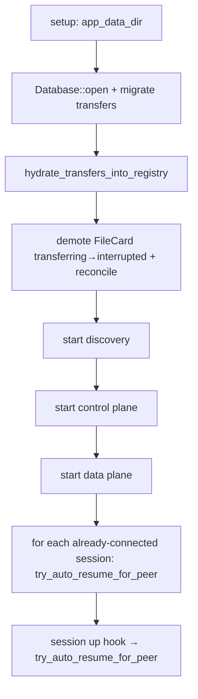

# 大文件断点续传设计（Resumable Transfer）

| 字段 | 值 |
|------|-----|
| **Title** | Large-file resumable transfer for jotainchatttttttt |
| **Author** | — |
| **Date** | 2026-07-14 |
| **Status** | Implemented PR-R1…R4（2026-07-14） |
| **App** | jotainchatttttttt（LAN-only Mac chat + file transfer） |
| **Stack** | Tauri 2 + Rust + React/TS + SQLite |
| **Prior art** | `docs/2026-07-14-resume-transfer-design.md`（v1.1 草案） |
| **Code base** | `/Users/xiatong/Documents/jotainchatttttttt` |

---

## Overview

当前传输（`src-tauri/src/net/transfer.rs`）在 `FileOffer → FileAccept → 单条 DATA TCP 从 offset=0 推到 EOF → 整文件 SHA-256 trailer` 路径上，任何 Wi‑Fi 闪断、休眠、短暂断链都会让接收端 **删除 `*.partial`**（见 `handle_inbound_data` Err 分支 L527–528 无条件 `fs::remove_file`；hash mismatch 在 L479 亦删），注册表清空，用户必须重新 Accept 并整文件重下。

本设计在 **同一 `file_id` / 同一 token 授权** 下，允许从已写入的字节继续传输；中断保留 partial；脏尾按 `CHUNK=256KiB` 对齐 truncate；完成后仍做整文件 SHA-256。协议对小文件统一走 `offset=0` 路径。状态跨进程重启持久化到 SQLite `transfers` 表。

---

## Background & Motivation

### 现网行为（已对照源码）

| 环节 | 代码位置 | 现状 |
|------|----------|------|
| 数据头 | `DataHeader { file_id, token, size, name }`（`transfer.rs` L39–44） | **无 `offset`** |
| 发送 | `push_file_to_peer` | 从文件头读到 EOF，边读边 SHA-256，写 trailer |
| 接收 | `handle_inbound_data` L404–418 | 每次 `unique_dest` + `File::create(&partial)` **总是新建/截断**；期望读 `header.size` 字节 |
| 失败清理 | Err 分支 L527–528 | **`fs::remove_file(&partial)` 无条件删除**（含网络 EOF / cancel）；hash mismatch L479 亦删 |
| 入站注册表 | Accept 后仍在 `inbound`；数据到达时 **`inbound.remove`**（L386–388） | 失败后 **无 resume 状态 / 丢 token** |
| 出站注册表 | `on_file_accept_wire` L655–659 **`outbound.remove`** 再 spawn push；push 结束 L314–318 再清 | 失败后 **无 source_path / token** |
| Token | `PendingInbound` / `PendingOutbound` 仅内存 | 进程退出即丢 |
| 目标路径 | 每次 inbound 调用 `unique_dest`（`fsutil.rs` L31–54 只看 **最终 path** 是否存在，不看 `*.partial`） | 续传若重跑会 **换新路径** 或 **撞名** |
| 控制面 | `WireMessage::FileAccept` 仅 `fileId`+`messageId` | 无 resume 语义 |
| 失败 progress | `emit_progress(..., 0, ...)` L336–344 / L543–551 | UI `bytes_done` **归零** |
| UI | `App.tsx` file card | 仅 Accept / Reject / Cancel；无 Resume |
| 持久化 | `db.rs` 仅 `messages` 表；body = `FileCard` JSON | 无 token / path 稳定性 / interrupted |
| 未知 wire | `session.rs` L666–671 | warn `TCP-FRAME-BAD`，**不断 session** |
| 地址重解析 | `resolve_peer_address` L707–725 + `socket_addr_str` | 已有；续传必须继续用 |

### 痛点

1. 数 GB 文件在不稳定 LAN 上几乎必失败；重传浪费带宽与时间。  
2. `PROGRESS_DB_EVERY = 1 MiB` 会把中间进度写入 `FileCard.bytesDone`，但失败后 UI 显示 `failed` 且 partial 已删，进度无意义。  
3. Sleep/wake 后 IP 可能变化；控制面会 reconcile 掉 session，但 **数据面失败无恢复路径**。

### 端口与版本（不变）

- UDP **48765** discovery，`PROTOCOL_VERSION = 1`（`discovery.rs`）  
- TCP **48766** control，TCP **48767** data  
- 控制面协议版本 **不 bump**；续传能力用 **新 wire 消息类型** `fileResume` / `fileResumeReject` 演进。  
- 数据头增加 `offset`（serde 缺省 0）。

---

## Goals & Non-Goals

### Goals

1. 同一 `file_id` 在网络/进程中断后可从已写字节续传。  
2. 首次接收仍 **confirm-by-default**（必须 Accept）；续传 **不** 再弹 Accept。  
3. 脏尾安全：chunk 对齐 truncate，v1 不做 per-chunk hash。  
4. 收齐后整文件 SHA-256 与 trailer（及可选 Offer 预带）一致。  
5. 进程重启后可恢复可续传任务（`transfers` 表）。  
6. 自动续传（peer online + session）+ 手动 **Resume** 按钮。  
7. 小文件与大文件统一协议（`offset=0` 即今日路径）。  
8. Cancel / 删除历史中的未完成传输：删除 partial、作废 token、不可 Resume。  
9. 诊断码可定位中断 / 对齐 / 协商 / 超时 / 完成。

### Non-Goals

- 云端、公网 P2P、多源并行、分块独立可校验的 CDN 式协议  
- 文件夹递归 / 多文件打包  
- Windows / Linux  
- E2E 加密升级（仍为 LAN 信任模型）  
- v1 块级 CRC / Merkle / 增量 hasher 落盘  
- 改变 discovery / control 端口或强制 `PROTOCOL_VERSION` 破坏性升级

---

## Proposed Design

### 高层架构

```mermaid
sequenceDiagram
  participant UI as UI (App.tsx)
  participant Recv as Receiver transfer.rs
  participant Ctrl as Control TCP 48766
  participant Send as Sender transfer.rs
  participant Data as Data TCP 48767
  participant DB as SQLite messages + transfers

  Note over UI,DB: First transfer
  Send->>Ctrl: fileOffer(fileId,token,size,...)
  Ctrl->>Recv: on_file_offer_wire
  Recv->>DB: insert FileCard state=offered + transfers row role=recv
  UI->>Recv: accept_file
  Recv->>Recv: reserve_dest exclusive placeholder
  Recv->>Ctrl: fileAccept(fileId,messageId)
  Ctrl->>Send: on_file_accept_wire
  Send->>Data: DataHeader(offset=0) + bytes[0..size) + trailer
  Data->>Recv: handle_inbound_data write partial
  Note over Recv,Send: Glitch / sleep
  Recv->>DB: state=interrupted, keep partial+token, re-insert registry
  Send->>DB: state=interrupted, keep source_path+token, re-insert registry
  Note over UI,DB: Resume (auto or button)
  Recv->>Recv: align_offset(partial_len)
  Recv->>Ctrl: fileResume(fileId,token,resumeOffset=N)
  Note over Recv: start resume_wait timer T=20s
  Ctrl->>Send: on_file_resume_wire
  alt can serve
    Send->>Data: DataHeader(offset=N) + bytes[N..size) + trailer
    Data->>Recv: header.offset must == N; append; full rehash; rename
    Recv->>DB: completed
  else cannot / old peer / hang
    Send-->>Ctrl: fileResumeReject(reason) OR silence
    Recv->>Recv: reject or timer → interrupted + error, keep partial
  end
```

### 状态机

#### 接收端 FileCard / transfers.state

```text
offered
  ├─(Reject)→ rejected          [terminal, no partial, no reservation]
  ├─(Cancel / history delete)→ cancelled  [terminal; drop registry only]
  └─(Accept)→ accepted          [reserve dest+partial; token held; start FIRST_DATA_WAIT]
                 ├─(data start)→ transferring
                 │    ├─(EOF+hash OK)→ completed
                 │    ├─(Cancel)→ cancelled          [delete partial+placeholder, revoke]
                 │    ├─(hash mismatch)→ failed      [delete partial, no resume]
                 │    └─(I/O / EOF / disconnect)→ interrupted  [keep partial, resume OK]
                 ├─(FIRST_DATA_WAIT timeout, no data)→ interrupted @0  [keep reservation+token]
                 └─(Resume / auto from accepted|interrupted)→ transferring (resume_pending)
                      ├─ data OK path → completed / interrupted / failed
                      ├─ fileResumeReject → interrupted + error
                      └─ resume_timeout → interrupted + error=resume_timeout
```

#### 发送端

```text
offered
  ├─(peer Reject)→ rejected
  ├─(Cancel)→ cancelled
  └─(peer Accept)→ transferring
       ├─completed
       ├─cancelled
       └─interrupted  [keep source_path + token in memory+DB]
            ├─(peer fileResume, validated)→ transferring
            └─(Cancel / source gone)→ cancelled | failed
```

**可 Resume 条件（接收端）：**

- `state ∈ {interrupted, accepted}`（**hash mismatch / cancelled / rejected / completed 永不 resume**）  
  - `accepted`：路径已预订、尚未收到合法数据 body（含 FIRST_DATA_WAIT 窗口内；超时后通常已 demote 为 `interrupted`，但 `resume_file` 仍接受残留 `accepted` 以免竞态丢状态）  
  - `interrupted`：已有 partial 字节或 first-data/resume 超时后  
- `transfers` 行（或内存 `PendingInbound`）存在且 `token` 非空，且 **已 Accept**（`accepted=true` / 有 dest 预订）  
- partial 路径已预订；文件可为空（offset=0）  
- peer 有 control session  
- `file_id` 不在 `active_files`  
- 不在 `resume_inflight`（见 §resume_file）；已 inflight 则幂等 Ok  

**可服务 Resume 条件（发送端）：**

- 内存或 `transfers` 有 `role=send` 行，token 匹配  
- `source_path` 存在、`metadata.len() == size`  
- `source_mtime`（若有）一致  
- `offset < size` 且 `offset` 为合法 u64（发送端 **不改写** offset，不符则 reject）  
- `file_id` 不在 `active_files`（否则 `busy`）

---

## Protocol Invariants（必须遵守）

### INV-1 — Offset 协商（单一权威，无静默分叉）

```text
1. 接收端：aligned = prepare_partial_for_resume(partial_path)   // 磁盘 ground truth
            在 fileResume 中发送 resumeOffset = aligned
            （首次 Accept 后、尚无 Resume 时：若 partial 空则 expected=0，发送端 push offset=0）
2. 发送端：校验 0 <= resumeOffset < size，源文件 OK，token OK
            若任何校验失败 → 只发 fileResumeReject，**不** 开数据面
            若成功 → DataHeader.offset **必须等于** resumeOffset（原样 echo，禁止 clamp/改写）
3. 接收端收到 DataHeader：
            expected = 此刻对 partial 再跑 prepare_partial_for_resume 的返回值
                       （磁盘对齐长度；**不以** 可能过期的 pending.bytes_done 为准）
            若 resume_inflight 存在：亦可交叉检查 == inflight.offset（发 Resume 时冻结值）；
            以 **磁盘对齐结果** 为最终 expected（inflight 仅用于诊断不一致）
            要求 header.offset == expected
            若不等 → 拒绝本连接（shutdown），状态回 interrupted，error=offset_mismatch
            **禁止** 静默 truncate 到 header.offset 或静默忽略差异
```

**Key Decision 表述订正：** 「接收端权威」指 **协商时** 由接收端提出 offset；数据面 **header 必须等于已协商值**（echo），任何一方都不能单方面改写。expected 的 **source of truth = 磁盘 partial 对齐后长度**，不是内存 `bytes_done`。
### INV-2 — Path reservation

Accept 时 **强制** 独占预订最终路径（见 §Accept 路径预订）。

### INV-3 — Token 生命周期

| 时刻 | 动作 |
|------|------|
| Offer 生成 | mint 16 字节 CSPRNG → hex |
| Accept / 传输 / interrupted | 保留（内存；R3+ 亦在 `transfers`） |
| completed | 作废：删 `transfers` 行 / 清 registry |
| cancelled | 作废 + 删 partial |
| hash mismatch → failed | 作废 + 删 partial |
| fileResumeReject `token_mismatch` | 接收端保持 token（可能发送端状态丢）；用户可 Cancel 或等对端恢复 |

Token **永不** 写入 `messages.body` / `FileCard`。

### INV-4 — 等待数据定时器（Resume + 首次 Accept）

统一常量：**`DATA_WAIT = 20s`**（实现里可同名 `RESUME_WAIT` / `FIRST_DATA_WAIT`，值相同）。

#### INV-4a — `FIRST_DATA_WAIT`（Accept 之后）

接收端 **本地 Accept 成功并发出 `fileAccept` 后** 立即启动：

- **取消条件：** 本 `file_id` 数据连接通过校验并开始读 body。  
- **超时（无任何合法数据 body）：**  
  `state: accepted → interrupted`，`bytes_done = 0`（或 `align(len(partial))`，通常 0），  
  `error = "first_data_timeout"`（文案：对方未能开始发送，可点续传重试），  
  **保留** reservation / token / 空 partial，`resume_capable = true`。  
- 解决：发送端 push 在连数据面之前失败时，接收端 **不会永远停在 `accepted` 且无法 Resume**。  
- 不依赖发送端额外控制面通知。

#### INV-4b — Resume wait（`fileResume` 之后）

接收端发出 `fileResume` 后：

- 启动同一 **`DATA_WAIT = 20s`**。  
- **取消条件：** 本 `file_id` 数据连接通过校验并开始读 body；或收到 `fileResumeReject`。  
- **超时：** `state → interrupted`，`error = "resume_timeout"`（文案：对方未响应续传，可能是旧版本或已离线），**保留 partial 与 token**，`resume_capable = true`。  
- 连续超时次数（per file_id，含 first_data + resume，进程内计数）≥ **3** → 额外提示「对方可能不支持续传，请请对方升级或重新发送」；暂停 auto-resume 直至用户手动 Resume 或成功收到数据后清零。
### INV-5 — `active_files` 与数据面线程同生命周期

```text
active_files.contains(file_id)  ⇔  存在正在执行 push 或 handle_inbound 的数据面线程持有该 file_id
```

插入后 **所有出口**（成功 / 失败 / cancel / 校验失败在 insert 之后）必须 `remove`；用 RAII/`scopeguard` 或函数末尾统一 `cleanup` 闭包，禁止只清 `active_cancel`。

---

## 关键实现约束（对照现码必须改掉的行为）

| # | 现码问题 | 设计要求 |
|---|----------|----------|
| 1 | Err L528 无条件 `remove_file(partial)` | 仅 **cancelled** 与 **sha256 mismatch** 删除；其它 → interrupted + 保留 |
| 2 | 每次 `unique_dest` + `File::create` | Accept 时 **`reserve_dest` 强制占位**；续传打开已有 partial |
| 3 | `inbound.remove` 后无状态 | **PR-R1 起**：失败 **re-insert** `PendingInbound`（token+paths+bytes） |
| 4 | `outbound.remove` 在 Accept 时 | push 期间可暂移出 map，但失败 **re-insert** `PendingOutbound`；DB（R3）始终保留至终态 |
| 5 | 发送 hasher 从当前读位置累计 | trailer = **整文件** SHA-256（见 §发送端 hash 时序） |
| 6 | 接收 hasher 从本次会话起点累计 | 完成后对 **完整 partial** 全量再扫 |
| 7 | Cancel 仅清 registry | `finalize_cancel`：停 I/O、删 partial/placeholder、清 DB、作废 token |
| 8 | 失败 `emit_progress(..., 0)` | **保留** last `bytes_done` |
| 9 | 历史删除只动 `messages` | 未完成传输视为 Cancel（见 §历史清理） |

---

## Protocol / Wire Changes

### 控制面 `WireMessage`（`protocol.rs`）

`#[serde(tag = "type", rename_all = "camelCase")]` 枚举扩展。未知 type → `from_bytes` 失败 → `TCP-FRAME-BAD` warn，**不断 session**（`session.rs` L666–671）。旧发送端对 `fileResume` 即此路径 → 接收端靠 **INV-4 超时** 恢复，而非永远 hanging。

#### `fileAccept`（v1 **不扩展**）

保持现字段，避免与 resume 语义混淆（见 Alternatives A / Issue 9）：

```json
{ "type": "fileAccept", "fileId": "…", "messageId": "…" }
```

> **决策：** 首次用 `fileAccept`；**续传只用 `fileResume`**。不在 Accept 上携带 `resumeOffset` / `capabilities`（v1）。若未来需要能力宣告，另议，不参与 offset 协商。

#### 新增 `fileResume`

```rust
#[serde(rename = "fileResume")]
FileResume {
    #[serde(rename = "fileId")]
    file_id: String,
    #[serde(rename = "messageId")]
    message_id: String,
    /// 对齐后的字节偏移（接收端提出；发送端必须原样 echo）
    #[serde(rename = "resumeOffset")]
    resume_offset: u64,
    /// 与 Offer 时相同的 16 字节 hex token
    token: String,
},
```

```json
{
  "type": "fileResume",
  "fileId": "…",
  "messageId": "…",
  "resumeOffset": 104857600,
  "token": "a1b2…32 hex chars"
}
```

#### 新增 `fileResumeReject`

与现有 `FileAccept` / `FileOffer` 一致：**每个字段显式 `serde(rename = "camelCase")`**（不要依赖枚举级 `rename_all` 覆盖 variant 字段——现码惯例如此）。

```rust
#[serde(rename = "fileResumeReject")]
FileResumeReject {
    #[serde(rename = "fileId")]
    file_id: String,
    #[serde(rename = "messageId")]
    message_id: String,
    /// unknown_file | token_mismatch | source_missing |
    /// source_changed | offset_invalid | busy
    reason: String,
    #[serde(default)]
    detail: Option<String>,
},
```

`fileResume` 已用显式 rename；`FileResume` / `FileResumeReject` 实现时 **禁止** 漏写 `fileId`/`messageId`/`resumeOffset` rename。

接收端：`state → interrupted`，展示 reason/detail，**保留 partial**；清除 `resume_inflight` 与 wait timer。

| reason | 建议 UI | 自动重试？ |
|--------|---------|------------|
| `busy` | 对方忙，稍后 | 是（有限次 backoff） |
| `unknown_file` | 对方尚无任务（可能刚重启） | 是（有限次） |
| `source_missing` / `source_changed` | 请对方重新发送 | 否 |
| `token_mismatch` | 状态不同步，建议 Cancel 后重发 | 否 |
| `offset_invalid` | 续传偏移非法 | 否（对齐 bug，打诊断） |

#### `fileProgress` 控制面 ACK

**v1 不做。**

#### `FileOffer` 可选 `sha256`（PR-R4）

v1 不实现；trailer 强制。

### 数据面 Header / Trailer（`transfer.rs`）

```rust
#[derive(Debug, Clone, Serialize, Deserialize)]
#[serde(rename_all = "camelCase")]
struct DataHeader {
    file_id: String,
    token: String,
    size: u64,          // 完整文件大小
    name: String,
    #[serde(default)]
    offset: u64,        // 缺省 0；必须等于协商值
}

struct DataTrailer { sha256: String }  // 整文件 hex
```

| 规则 | 说明 |
|------|------|
| 负载长度 | 恰好 `size - offset` 字节，然后一条 trailer frame |
| `offset == 0` | 写 partial（已预订路径上 create/truncate partial 内容；**不** 重新 unique_dest） |
| `offset > 0` | partial 必须存在；长度已是 offset；append |
| `offset >= size` | 非法 → 发送端应 `offset_invalid`；接收端拒连接 |
| trailer | 仅推完到 `size` 时发送；**整文件** SHA-256 |
| offset 匹配 | **INV-1**：`header.offset == prepare_partial_for_resume(disk)` 否则拒（非 `bytes_done`） |

### 脏尾对齐算法

常量：`const CHUNK: usize = 256 * 1024;`（`transfer.rs` L30）

```rust
fn align_resume_offset(partial_len: u64) -> u64 {
    let chunk = CHUNK as u64;
    (partial_len / chunk) * chunk
}

fn prepare_partial_for_resume(partial: &Path) -> Result<u64, String> {
    let meta = fs::metadata(partial).map_err(|e| e.to_string())?;
    let len = meta.len();
    let aligned = align_resume_offset(len);
    if aligned < len {
        let file = OpenOptions::new().write(true).open(partial)
            .map_err(|e| e.to_string())?;
        file.set_len(aligned).map_err(|e| e.to_string())?;
        file.sync_all().ok();
        diagnostics::info(..., XferAlign, format!("from={len} to={aligned}"));
    }
    Ok(aligned)
}
```

- 浪费上界：**&lt; 256 KiB** / 次中断。  
- v1 **不做** 块 hash。

### session.rs 分发

```rust
Ok(WireMessage::FileResume { file_id, message_id, resume_offset, token }) => {
    transfer::on_file_resume_wire(&app, &peer_id, file_id, message_id, resume_offset, token);
}
Ok(WireMessage::FileResumeReject { file_id, message_id, reason, detail }) => {
    transfer::on_file_resume_reject_wire(&app, &peer_id, file_id, message_id, reason, detail);
}
// FileAccept 保持两字段解构，不变
```

---

## Accept 路径预订（强制）

### 问题

`fsutil::unique_dest`（L31–54）只检查 **最终文件** 是否存在。仅创建 `name.partial` **不能** 阻止第二个 Accept 得到相同 `dest`。两路 resume 会写坏同一 partial。

### `reserve_dest` 规格

在 `fsutil.rs` 新增（或扩展 `unique_dest`）：

```rust
/// 在 save_dir 下为 basename 分配独占最终路径。
/// 视为「已占用」：
///   - `candidate` 存在（正式文件）
///   - `candidate.partial` 存在
///   - （可选）进程内 `reserved: HashSet<PathBuf>` 中的路径
/// 预订成功后：
///   1. 以 create_new 创建 0 字节 placeholder 于 `dest`（独占）
///   2. 创建空 `dest.partial`（create_new）
/// 回滚（强制）：
///   若步骤 1 成功而步骤 2 失败（ENOSPC / 竞态 / 权限）：
///     删除本轮已创建的 `dest` placeholder，再换下一 candidate 重试；
///     不得留下孤儿 placeholder 永久占名。
///   若两步都成功后函数因其它原因失败：同样删 dest+partial 再返回 Err 或重试。
/// 单测：注入 partial create_new 失败 → 无残留 dest、可再次 reserve 同 basename。
pub fn reserve_dest(dir: &Path, basename: &str) -> Result<(PathBuf /*dest*/, PathBuf /*partial*/), String>;
```

**Accept 路径（强制，非可选）：**

```rust
let save_dir = fsutil::default_save_dir()?;
let (dest, partial) = fsutil::reserve_dest(&save_dir, &name)?;
entry.dest_path = Some(dest.clone());
entry.partial_path = Some(partial.clone());
entry.accepted = true;
// upsert transfers (R3+); R1+ 至少写内存
```

**完成时 rename 语义：**

```text
// partial 已写满且 hash OK
fs::remove_file(&dest)?;           // 去掉 0 字节 placeholder
fs::rename(&partial, &dest)?;      // 原子替换为正式文件
```

**Cancel / finalize_cancel / hash fail：**

```text
remove partial if exists
remove dest placeholder if exists and size==0 (or always if still placeholder-marked)
// 若 dest 已是用户其它文件则禁止乱删：仅删「本 transfers 记录的 path」且
// 完成前 dest 应仅为我们 create_new 的 placeholder（len==0）或仍不存在
```

**Reject（未 Accept）：** 无预订，无文件。

**进程崩溃后：** placeholder（0 字节 dest）+ partial 可能残留；hydrate 时若 `transfers` 有行则认领；若无 `transfers` 行的孤儿 `*.partial`，启动时可选扫描清理（v1：仅清理有 transfers 行可对账的；无行孤儿留待用户或后续 GC）。

---

## Registry Lifecycle（精确）

### 目标结构

```rust
pub struct TransferRegistry {
    inbound: HashMap<String, PendingInbound>,
    outbound: HashMap<String, PendingOutbound>,
    active_cancel: HashMap<String, Arc<AtomicBool>>,
    /// INV-5: 与数据面线程同寿命
    active_files: HashSet<String>,
    /// 接收端：已发 fileResume、等待数据或 reject/timeout
    resume_inflight: HashMap<String, ResumeInflight>,
    /// 自动续传：每 peer 并发上限与 debounce
    auto_resume_sem: HashMap<String /*peer_id*/, u8>, // in-flight count
}

struct ResumeInflight {
    message_id: String,
    peer_id: String,
    offset: u64,
    started: Instant,
    /// 取消 auto 调度用
    generation: u64,
}

struct PendingInbound {
    file_id: String,
    message_id: String,
    peer_id: String,
    name: String,
    size: u64,
    mime: String,
    token: String,
    cancel: Arc<AtomicBool>,
    accepted: bool,
    dest_path: Option<PathBuf>,
    partial_path: Option<PathBuf>,
    bytes_done: u64,
}

struct PendingOutbound {
    file_id: String,
    message_id: String,
    peer_id: String,
    path: PathBuf,
    name: String,
    size: u64,
    mime: String,
    token: String,
    peer_address: String,
    cancel: Arc<AtomicBool>,
    cached_sha256: Option<String>,
    source_mtime: Option<SystemTime>,
}
```

### 生命周期表

| 事件 | inbound | outbound | active_cancel | active_files | resume_inflight | transfers | 磁盘 |
|------|---------|----------|---------------|--------------|-----------------|-----------|------|
| Offer 入 | insert accepted=false | — | — | — | — | upsert recv offered | 无 |
| 本地 Accept | accepted=true；**reserve_dest**；启动 FIRST_DATA_WAIT | — | insert | — | — | accepted | placeholder+空 partial |
| FIRST_DATA_WAIT 超时 | state→interrupted@0，resume_capable | — | 保持 cancel 可清 | — | — | interrupted | **保留** reservation |
| 对端 Accept | — | 取出 spawn push；**失败 re-insert** | insert | insert | — | transferring | — |
| 数据开始 recv | 取出到栈；失败 **re-insert interrupted** | — | 保持 | insert | clear if any | transferring | partial 增长 |
| 网络失败 | re-insert interrupted + token+paths | re-insert interrupted | remove | remove | — | interrupted | **保留** |
| 成功 | 不回插 | remove | remove | remove | — | delete row | rename |
| Cancel | remove | remove | set true | （线程 cleanup remove） | remove | delete | **删** partial+placeholder |
| fileResume 发 | 保持 interrupted 条目或标记 inflight | — | — | — | insert | 可标 transferring | align truncate |
| fileResume 入 send | — | 校验；spawn push(offset) | insert | insert | — | transferring | — |
| Resume reject/timeout | 保持/回 interrupted | — | — | — | remove | interrupted | 保留 |
| hydrate | 从 DB 装入 | 同左 | 新 flag | 空 | 空 | 只读 | 校验 |

### 谁发起 Resume

| 角色 | 职责 |
|------|------|
| **接收端** | 唯一发起方：`resume_file` / auto |
| **发送端** | 被动校验 + push；**不** 主动重推未完成 outbound |

### `resume_file` 状态机（伪代码）

```rust
pub fn resume_file(app, message_id, peer_id) -> Result<(), String> {
    // 1. 加载
    let row = registry.inbound or db.get_transfer_by_message(message_id)
        .ok_or("No resumable transfer")?;
    require row.peer_id == peer_id;
    require row.role == recv (command is receiver-side);
    // accepted（已预订、尚无/等待数据）与 interrupted 均可 Resume
    require card/row.state in {"interrupted", "accepted"};
    require paths reserved (dest_path + partial_path + token);
    require !active_files.contains(file_id);
    require !resume_inflight.contains(file_id);  // 防 double-click / auto 重入
        // 若已 inflight：Ok(()) 幂等返回，不发第二帧

    // 2. Session
    require session connected else Err("Not connected");

    // 3. 磁盘对齐（ground truth；常为 0 当 accepted 空 partial）
    let partial = row.partial_path.ok_or("missing partial path")?;
    if !partial.exists() {
        // 允许从 0：create_new/open 空文件于已预订 partial
    }
    let offset = prepare_partial_for_resume(&partial)?;  // 空文件 → 0

    // 4. 取消 FIRST_DATA_WAIT（若仍在跑）；标记 inflight
    cancel_first_data_timer(file_id);
    let gen = next_generation();
    resume_inflight.insert(file_id, ResumeInflight { offset, generation: gen, ... });
    update_file_message: state=transferring, bytes_done=offset, resume_capable=true, error=None

    // 5. 发 wire（offset=0 时等价「重新拉起首次 push」）
    send FileResume { file_id, message_id, resume_offset: offset, token };

    // 6. 启动 wait timer (INV-4b)
    spawn_timer(DATA_WAIT, file_id, gen, || {
        if resume_inflight.get(file_id).generation == gen {
            resume_inflight.remove(file_id);
            set interrupted, error=resume_timeout, resume_capable=true
            bump timeout_count; maybe disable auto until manual
            XFER-RESUME-FAIL reason=timeout
        }
    });

    Ok(())
}

// accept_file 成功路径末尾（INV-4a）：
//   reserve_dest; state=accepted; send fileAccept;
//   spawn_timer(DATA_WAIT, file_id, gen, || {
//     if still accepted && !active_files && no body started:
//       state=interrupted; bytes_done=0; error=first_data_timeout; resume_capable=true
//       XFER-INTERRUPT reason=first_data_timeout
//   });

// on_file_resume_reject_wire:
//   if resume_inflight has file_id: remove; cancel timer
//   state=interrupted; error=reason; resume_capable 按 reason 表
//   busy|unknown_file → schedule_retry limited

// handle_inbound_data 校验通过开始读 body 时:
//   resume_inflight.remove(file_id); cancel FIRST_DATA_WAIT + resume timers
```

#### 竞态表（Accept / Resume / Cancel / Auto）

| 场景 | 处理 |
|------|------|
| 二次 Accept | 现码拒绝；保持 |
| interrupted 时 Accept | UI 不显示；invoke → `Err` 或内部转 `resume_file` |
| **双击 Resume / Resume+auto** | `resume_inflight` 命中 → 第二次 **幂等 Ok**，不发第二帧 |
| **accepted 尚无字节**（Accept 后 sender 仍在连 / 已失败） | **允许 Resume**（`state ∈ {accepted, interrupted}`）。同时跑 **FIRST_DATA_WAIT**：20s 无数据 → 自动 demote `interrupted@0` + `resume_capable`。用户可在 demote 前/后点 Resume → `fileResume(0)`。发送端若仍在 first push → `busy`，接收端回 interrupted 后再试。**禁止**「只能 Cancel / 不能 Resume」旧表述。 |
| **发送端 push 在数据到达前失败** | 发送端 → interrupted + re-insert outbound。接收端无数据事件 → 靠 FIRST_DATA_WAIT demote，或用户/auto `fileResume(0)` 拉起。 |
| **hydrate：`accepted` + 空 partial** | demote 为 `interrupted@0`（或保留 accepted 但 auto/UI 仍可 `resume_file`）；session up 时 auto 对 `accepted\|interrupted` 且已预订路径的 recv 调 `resume_file`。 |
| **Auto 已调度，用户 Cancel** | Cancel 递增 generation / 设 cancel flag；timer 与 auto 任务检查 generation 与 state，若 cancelled 则 **不** 发 Resume；`finalize_cancel` 立即删盘 |
| **发送端仍在 first push，接收端已 interrupted 并发 Resume** | 发送 `active_files` → `fileResumeReject{busy}`；接收端回 interrupted，**不** 卡在 transferring |
| **Cancel 时数据面仍在写** | 先 `cancel.store(true)`；循环 `Err("cancelled")` → **统一** `finalize_cancel`；interrupted/accepted 无 active 时 Cancel **立即** `finalize_cancel` |

### 并发传输

- 多 `file_id` 并行：保持现网。  
- **同一 file_id**：`active_files` + `resume_inflight` 串行化。  
- **自动续传并发上限：** 每 peer **最多 1** 路 auto-resume 同时 in-flight（`auto_resume_sem`）；队列串行。**手动 Resume 不受限**（仍受 active_files 约束）。  

### 双端进程重启与 hydrate 顺序



**硬顺序（`lib.rs` setup）：**

1. `Database::open`（含 `transfers` migration）  
2. `hydrate_transfers` — **在任何 network start 之前** 完成，保证 registry 非空  
3. `discovery::start_*` / `net::start_control_plane` / `net::start_data_plane`  
4. **已连接 peer 扫描：** control 启动后短暂 delay（如 500ms）或 session map 非空时，对 `sessions.list()` 每个 peer 调 `try_auto_resume_for_peer`（因 `TcpSessionUp` **不会** 在 app 启动时对「尚未连上、稍后才连」之外的「启动瞬间已存在」重放——启动时 session 为空，连上后会走 session up；两者都要覆盖）  
5. 之后每次 `TcpSessionUp` → `on_peer_session_up` → debounce 1.5s → `try_auto_resume_for_peer`

**对账规则（冲突时）：**

| 字段 | 权威 |
|------|------|
| token, paths, size, role | **`transfers` 行** |
| UI 展示 state/bytes | hydrate 后 **写回 FileCard** 与 transfers 对齐 |
| transfers 无行、卡片 transferring | 降级 interrupted；无 token → **不可 resume**，标 failed「状态丢失，请重新发送」 |
| transfers 有行、卡片 completed | 删 transfers 行（以卡片终态为准） |

**双方同时重启：**

- 接收端可能先 Resume → 发送端尚未 hydrate → `unknown_file`  
- **有限重试：** `unknown_file` / `busy` → 最多 **3** 次，间隔 **2s, 4s, 8s**（指数），仍失败则 interrupted + error，等手动或下次 session up（session up 重置 auto 计数）

**`accepted` / `transferring` 降级：**

- 卡片或 transfers 为 `transferring` 且无 active 线程 → `interrupted`，`bytes_done = prepare_partial_for_resume`（磁盘对齐）  
- `accepted` 且无 active 数据 → hydrate 时 **一律 demote `interrupted`**，`bytes_done = align(len(partial))`（多为 0）；保留 token/paths；`resume_capable=true`  
- auto / 手动对 `interrupted`（及残留 `accepted`）发 `fileResume(offset)`；发送端需仍持有 outbound/token（**PR-R1 发送失败必须 re-insert outbound**）
---

## Token 安全

| 项 | v1 决策 |
|----|---------|
| 生成 | `random_token()`：16 字节 CSPRNG → hex |
| 传输 | LAN control/data；与今日 Offer 相同 |
| 存储 | R1–R2：内存；R3+：`transfers.token` 明文（App Support） |
| FileCard | **禁止** 存 token |
| 作废 | 见 INV-3 |

---

## Data Model Changes

### 新表 `transfers`（`db.rs`，PR-R3；R1 可不建表）

```sql
CREATE TABLE IF NOT EXISTS transfers (
  file_id       TEXT PRIMARY KEY NOT NULL,
  role          TEXT NOT NULL,           -- 'send' | 'recv'
  peer_id       TEXT NOT NULL,
  message_id    TEXT NOT NULL,
  path          TEXT NOT NULL,           -- send: source; recv: final dest
  partial_path  TEXT,                   -- recv only
  name          TEXT NOT NULL,
  size          INTEGER NOT NULL,
  mime          TEXT NOT NULL DEFAULT '',
  token         TEXT NOT NULL,
  bytes_done    INTEGER NOT NULL DEFAULT 0,
  state         TEXT NOT NULL,
  source_mtime  INTEGER,
  error         TEXT,
  created_at    INTEGER NOT NULL,
  updated_at    INTEGER NOT NULL
);
CREATE INDEX IF NOT EXISTS idx_transfers_peer_state ON transfers(peer_id, state);
CREATE INDEX IF NOT EXISTS idx_transfers_message ON transfers(message_id);
```

```rust
pub fn upsert_transfer(&self, row: &TransferRow) -> Result<(), String>;
pub fn get_transfer(&self, file_id: &str) -> Result<Option<TransferRow>, String>;
pub fn get_transfer_by_message(&self, message_id: &str) -> Result<Option<TransferRow>, String>;
pub fn list_resumable_transfers(&self) -> Result<Vec<TransferRow>, String>;
pub fn update_transfer_progress(&self, file_id: &str, bytes_done: u64, state: &str) -> Result<(), String>;
pub fn delete_transfer(&self, file_id: &str) -> Result<(), String>;
pub fn list_transfers_for_peer(&self, peer_id: &str) -> Result<Vec<TransferRow>, String>;
pub fn list_all_active_transfers(&self) -> Result<Vec<TransferRow>, String>;
```

终态：completed / cancelled / rejected / failed(hash) → **删除** `transfers` 行；interrupted 保留。

### `FileCard` 扩展

```rust
pub struct FileCard {
    pub file_id: String,
    pub name: String,
    pub size: u64,
    pub mime: String,
    pub bytes_done: u64,
    pub state: String,  // + interrupted
    pub local_path: Option<String>,
    pub sha256: Option<String>,
    pub error: Option<String>,
    #[serde(default)]
    pub resume_capable: bool,
}
```

（去掉冗余 `peer_device_id`；`message.peer_id` 足够。）

### Preferences

```rust
#[serde(default = "default_true")]
pub auto_resume_transfers: bool,  // default true
```

### 历史清理策略（强制）

与 `delete_message` / `clear_thread` / `clear_all_history` 交互。对将删除的每条 **file** 消息按 **当前状态** 分支：

| 本地状态 | 行为 |
|----------|------|
| **`offered`（尚未 Accept）· 入站** | **无磁盘预订**。`inbound.remove(file_id)`；清 `active_cancel` 若有；无 `finalize_cancel` 磁盘路径。Best-effort 发 `FileReject`（对端仍在 offered 时）；若 session 已断则静默。然后删 message 行。 |
| **`offered`（尚未被 Accept）· 出站** | `outbound.remove(file_id)`；best-effort `FileCancel`；删 message。无 partial。 |
| **`accepted` / `transferring` / `interrupted`** | **等同 Cancel**：`finalize_cancel(file_id)`（停 I/O、删 partial+placeholder、删 transfers、作废 token、清 resume_inflight / first-data timer）。Wire `FileCancel` best-effort。然后删 message。 |
| **`rejected` / `cancelled` / `failed` / `completed`** | 仅删 message（及若仍残留的 transfers 行则 delete）；**completed 磁盘文件不删**。 |

| API | 行为 |
|-----|------|
| `delete_message` | 上表按单条 message 的 FileCard/registry 状态执行，再 `DELETE` message。 |
| `clear_peer` / `clear_all` | 对范围内每条 file 消息同样分支；再删 messages。 |
| completed 的磁盘文件 | **不删除**（与现产品文案一致）。 |

防止：清聊天后 registry 残留 / auto-resume 复活幽灵；以及 **纯 offered 删除后仍可误 Accept**。
---

## 核心函数改动规格

### `push_file_to_peer`（+ offset）

```rust
fn push_file_to_peer(..., offset: u64, ...) {
    // cleanup 闭包：active_files.remove, active_cancel.remove；
    // 成功 delete_transfer；失败 re-insert outbound + interrupted
    let _guard = scopeguard::guard(file_id.clone(), |id| { /* 见 INV-5 */ });

    resolve_peer_address → connect_data_with_retry
    // 源文件时序（Issue 8）：
    let mut file = File::open(&path)?;
    let meta1 = file.metadata()?;
    require meta1.len() == size;
    let mtime1 = meta1.modified().ok();
    file.seek(SeekFrom::Start(offset))?;

    write DataHeader { offset, ... }  // offset 原样
    // read/write loop until size; bytes_done = offset + sent
    // 结束前：
    let meta2 = fs::metadata(&path)?;
    if meta2.len() != size || meta2.modified().ok() != mtime1 {
        return Err("source_changed"); // 不写 trailer；对端 EOF/timeout → interrupted
    }
    let digest = if let Some(c) = cached_if_valid {
        c
    } else {
        sha256_file(&path)?  // 全量
    };
    // 再 stat 一次可选
    write DataTrailer { sha256: digest }
    // success path...
}
```

**源变更窗口：** 发送中途被替换 → 可能 trailer 与已发字节不一致；接收端全量 rehash 失败 → **failed + 删 partial**（罕见；可接受）。发送端在发现 mtime/size 变时 **不发 trailer**，接收端会 EOF/trailer 读失败 → **interrupted**（保留 partial，优于错文件 completed）。

### `handle_inbound_data` 伪代码

```text
read DataHeader
lock registry:
  if active_files.contains → reject
  pending = take inbound after validate
            (accepted || interrupted) + token + size + reserved paths
  // INV-1 expected —— 磁盘为 ground truth（勿用 stale pending.bytes_done）
  let partial = pending.partial_path.unwrap()
  let expected = prepare_partial_for_resume(&partial)?
      // 空 partial → 0；非空 → align(len)；会 truncate 脏尾
  // 可选诊断：if let Some(inf) = resume_inflight.get(file_id) {
  //   if inf.offset != expected { log XFER-ALIGN or warn drift }
  // }
  if header.offset != expected:
      reject connection; re-insert pending interrupted; return offset_mismatch
  // 首次 push offset=0 且 expected=0：通过
  active_files.insert
  active_cancel.insert
  cancel FIRST_DATA_WAIT / resume wait timers; resume_inflight.remove

// defer cleanup INV-5:
//   active_files.remove; active_cancel.remove;
//   on fail non-cancel non-hash: re-insert interrupted + update bytes from disk;
//   on cancel/hash: delete paths

open partial at reserved path (never unique_dest again)
// header.offset == 0: 可 truncate partial 内容后写；路径仍是预订路径
// header.offset  > 0: seek/append，长度已是 expected
read size-offset bytes; progress; bytes_done 不在 fail 时清零
trailer + full rehash
success: remove placeholder dest, rename partial→dest
```

### 新 / 关键函数

| 函数 | 职责 |
|------|------|
| `fsutil::reserve_dest` | 独占预订 dest+partial |
| `resume_file` | 接收端入口（上节伪代码） |
| `on_file_resume_wire` | 发送端 |
| `on_file_resume_reject_wire` | 接收端 |
| `prepare_partial_for_resume` | 对齐 |
| `sha256_file` | 整文件摘要 |
| `hydrate_transfers` | setup，network 之前 |
| `try_auto_resume_for_peer` | 串行 per-peer，上限 1 auto |
| `interrupt_transfer` | 统一失败→interrupted + **re-insert registry** |
| `finalize_cancel` | 停 I/O + 删盘 + DB + registry + inflight |
| `on_history_deleting_message` | 历史 API 钩子 → finalize_cancel |

### 自动续传触发

1. Session up 钩子 + 启动后已连接扫描。  
2. Debounce 1.5s / peer。  
3. `auto_resume_transfers == true`。  
4. `role=recv && state ∈ {interrupted, accepted} && 已预订路径 && timeout_count < 3`（或 manual 重置后）。  
   - 含：FIRST_DATA_WAIT 超时后的 interrupted@0；hydrate demote 的 accepted。  
5. **串行：** 每 peer 同时仅 1 个 auto `resume_file`；完成后队列下一个。  
6. 发送端无自动推。
### Cancel / finalize_cancel

```text
1. cancel_flag = true (active + pending)
2. resume_inflight.remove; bump generation
3. if active_files: 等待数据线程退出（或由线程自己 cleanup 调 finalize 磁盘部分）
   else: 立即删 partial + placeholder（路径来自 registry 或 transfers）
4. registry remove inbound/outbound/active_*
5. delete_transfer
6. FileCard state=cancelled, resume_capable=false, error=None
7. best-effort FileCancel wire
```

---

## API / Interface Changes

| Command | 说明 |
|---------|------|
| `resume_file(message_id, peer_id)` | 接收端续传 |
| `accept_file` | + `reserve_dest` |
| `cancel_file` | + `finalize_cancel` 全路径 |
| `delete_message` / `clear_*` | 钩子取消未完成传输 |
| `set_auto_resume_transfers` | 可选 |

### 事件

| 事件 | 变更 |
|------|------|
| `transfer-progress` | `state` 含 `interrupted`；**bytes_done 不归零** |
| `message` | FileCard 含 `interrupted` / `resumeCapable` |

### UI（`App.tsx`）

```tsx
type FileCard = {
  fileId: string;
  name: string;
  size: number;
  mime: string;
  bytesDone: number;
  state: string; // + "interrupted"
  localPath?: string | null;
  sha256?: string | null;
  error?: string | null;
  resumeCapable?: boolean;
};

// 进度条：transferring | accepted | interrupted
// Resume：direction==="in" && (state==="interrupted" || state==="accepted" || resumeCapable)
//   accepted 时按钮文案可仍为「Resume」/「重试发送」——语义都是 fileResume(offset)
// Cancel：transferring | accepted | offered | interrupted
// failed：无 Resume

// transfer-progress 处理：必须 patch 已有 card 字段，
// 只覆盖 bytesDone/state（及可选 error），**不得** JSON 整对象替换时丢掉 resumeCapable 等键。
// 现有实现 parseFileCard → 改字段 → stringify，保留未碰字段 —— 保持此模式。
```

发送端 interrupted：「等待对方续传」+ Cancel。

---

## Observability

| Variant | Code | 何时 |
|---------|------|------|
| `XferInterrupt` | `XFER-INTERRUPT` | 网络失败保留 partial |
| `XferResume` | `XFER-RESUME` | 发出/收到 fileResume |
| `XferResumeFail` | `XFER-RESUME-FAIL` | reject / timeout / offset_mismatch |
| `XferAlign` | `XFER-ALIGN` | 脏尾 truncate |
| `XferHydrate` | `XFER-HYDRATE` | 启动加载 |
| `XferReserve` | `XFER-RESERVE` | Accept 预订路径（可选） |

```text
XFER-INTERRUPT file=… peer=… bytes=… size=… err=…
XFER-ALIGN file=… from=… to=…
XFER-RESUME file=… offset=… role=send|recv
XFER-RESUME-FAIL file=… reason=timeout|busy|unknown_file|…
```

---

## Security & Privacy

| 威胁 | 缓解 |
|------|------|
| 冒充 fileResume | token 熵；LAN 信任模型 |
| 任意 offset 读源 | 仅已登记 file_id+token；offset 校验；echo only |
| token 落盘 | App Support；不进 messages；终态删除 |
| 路径穿越 | `safe_basename` + 仅 save_dir |
| 历史删除残留 resume | finalize_cancel 钩子 |
| 磁盘满 | interrupted 保留已写 |

---

## Alternatives Considered

### A. 仅扩展 `fileAccept.resumeOffset`

否决；与 Accept 门闩混淆。**v1 亦不在 Accept 上挂死字段。**

### B. 每块 CRC

延后 v1.2+。

### C. 仅内存 token

否决（相对 R3 目标）；R1–R2 阶段允许仅内存作为增量交付，但 R3 必须落盘。

### D. 发送端主动 Range

否决；违背 confirm-by-default。

### E. 状态只在 FileCard

否决；token 进 messages、查询困难。

### F. 增量 SHA-256 checkpoint 落盘（`transfers` 存 hasher mid-state）

- **优点：** 完成时无需全量再读 multi-GB  
- **缺点：** 序列化 Digest 状态、版本脆弱、实现与测试成本高  
- **结论：** **v1 否决**；全量 rehash 在 LAN/本地 SSD 可接受（Decision #11）

---

## Risks

| 风险 | 严重度 | 缓解 |
|------|--------|------|
| 同 basename 路径碰撞 | 高 | **强制 reserve_dest**（INV-2） |
| offset 分叉写坏文件 | 高 | **INV-1** 严格相等 |
| Resume 后旧客户端挂死 | 高 | **INV-4** 20s 超时 |
| R1 丢 token 使 R2 无法接 | 高 | **R1 强制 re-insert registry** |
| 清历史残留 transfers | 高 | 历史 API → finalize_cancel |
| 源文件同 size 替换 | 中 | mtime 交叉检查 + 接收 rehash |
| 双端重启 unknown_file | 中 | 有限 backoff 重试 |
| auto-resume 惊群 | 中 | per-peer 串行 1 路 |
| `active_files` 泄漏 | 中 | cleanup 统一出口 INV-5 |
| 全量 rehash 慢 | 低 | 可接受；R4 Offer sha256 |
| IPv6 / IP 变更 | 低 | `resolve_peer_address` |

---

## Rollout Plan

1. 按 PR Plan；**R1 必须含 registry re-insert + Cancel 清 partial + reserve_dest**。  
2. R2 为风险最大垂直切片；合并前 must-pass 测试见下。  
3. 回滚：回退二进制；残留 transfers/partial 可手动删。  

---

## Testing Plan

### 单元测试

- `align_resume_offset` 边界  
- `DataHeader` 无 offset → 0  
- `FileResume` / `FileResumeReject` roundtrip  
- `FileCard` 旧 JSON 兼容  
- `reserve_dest`：同名两次得到不同 dest；`.partial` 存在时不复用 basename  
- `finalize_cancel` 删除 dest placeholder + partial  

### 集成 / QA

- [ ] 大文件 30% 拔网 → interrupted → Resume → hash OK  
- [ ] 杀接收端 → 重启 Resume（R3）  
- [ ] 杀发送端 → 接收 Resume + 发送 hydrate（R3）  
- [ ] Cancel → partial+placeholder 删除  
- [ ] 源文件修改 → reject / interrupted  
- [ ] sha256 mismatch → failed、删 partial  
- [ ] 并发两文件  
- [ ] 传输中重复 Resume → 幂等 / busy  
- [ ] sleep/wake IP 变化  
- [ ] 小文件 offset=0 无回归  
- [ ] **新接收端 × 旧发送端 fileResume → 20s 内 resume_timeout，partial 保留，可重试**  
- [ ] **Accept 后发送端数据面失败、接收端从未收数据 → ≤20s demote interrupted，Resume/fileResume(0) 可完成**  
- [ ] **accepted 状态 UI 显示 Resume 且 invoke 成功**  
- [ ] **双击 Resume 只发一帧**  
- [ ] **删除 interrupted 消息 → partial 与 transfers 清除，无 auto 复活**  
- [ ] **删除纯 offered 入站消息 → registry 无残留，不可再 Accept**  
- [ ] **clear_thread 同上**  
- [ ] **双方重启：unknown_file 后 backoff 成功或可手动恢复**  
- [ ] **Accept 两相同文件名 → 不同 dest，互不覆盖**  
- [ ] **reserve_dest 第二步失败 → 无孤儿 placeholder**  

### PR-R2 merge 前门禁（must-pass）

1. 同进程断网续传成功 + hash  
2. Resume timeout 回 interrupted  
3. busy / 幂等 Resume  
4. Cancel 删盘  
5. offset_mismatch 拒连接不静默 truncate  
6. 发送 source_changed 不写 trailer  
7. Accept 后无数据 → first_data_timeout demote → fileResume(0) 成功  

---

## Open Questions

1. **发送端 interrupted 是否允许「换源文件路径」？** 建议 v1 不允许，必须原 path 或重新 Offer。  
2. **`auto_resume_transfers` 是否进 Settings UI？** 建议 PR-R3，默认 true。  
3. **hash mismatch 是否保留 partial 供调试？** 建议删除（与现码一致）。  
4. **completed 后是否保留 transfers 行？** 建议删除。  
5. **Offer 预带 sha256？** PR-R4。  
6. **`DATA_WAIT` 20s 是否过短/过长？** 可配置常量；默认 20s（FIRST_DATA 与 Resume 共用）。  

（原 path reservation / timeout / history-clear 已收入 Key Decisions，不再作为阻塞 open question。）

---

## References

- `src-tauri/src/net/transfer.rs`（L30 CHUNK；L39–44 header；L314–318 / L527–528 cleanup；L386–388 inbound remove；L404–418 unique_dest；L655–659 outbound remove；L707–725 resolve）  
- `protocol.rs`、`session.rs` L666–671、`frame.rs`、`db.rs`、`fsutil.rs` L31–54、`diagnostics.rs`、`lib.rs` history commands  
- `src/App.tsx` file card / `transfer-progress`  
- `docs/2026-07-14-design.md`、`docs/2026-07-14-resume-transfer-design.md`

---

## Key Decisions

| # | 决策 | 理由 |
|---|------|------|
| 1 | **自动续传 + 手动 Resume**（接收端发起） | confirm-by-default；对端上线少操作 |
| 2 | **脏尾 = chunk 对齐 truncate**（256KiB），无块 hash | 简单；浪费有界 |
| 3 | **显式 `fileResume` + `fileResumeReject`**；`fileAccept` **不** 扩展 resume 字段 | 避免 Accept 语义污染 |
| 4 | **`DataHeader.offset` 默认 0**；trailer 整文件 SHA-256 | 统一协议 |
| 5 | 失败保留 partial → **`interrupted`**（cancel/hash 除外） | 可 Resume |
| 6 | **`transfers` 表** 持久化 token/path；**token 不进 FileCard** | 重启续传 + 隔离敏感字段 |
| 7 | **Accept 强制 `reserve_dest`**（placeholder + 视 `*.partial` 为占用） | 防同名碰撞与 unique_dest 漏洞 |
| 8 | **`active_files` 与数据线程同寿命**（统一 cleanup） | 防双连接与泄漏 |
| 9 | **Offset：接收端提出，发送端原样 echo，接收端要求相等**（INV-1） | 禁止静默分叉 |
| 10 | 失败 **`bytes_done` 不归零** | 修现码 progress 误导 |
| 11 | **整文件 rehash**；不落盘增量 hasher（否决 Alt F） | v1 正确性/复杂度权衡 |
| 12 | **`PROTOCOL_VERSION` 保持 1** | 新消息类型演进 |
| 13 | 续传继续 **`resolve_peer_address` + `socket_addr_str`** | sleep/wake IP |
| 14 | 非目标：云/多源/文件夹/Windows/块 CRC | 控范围 |
| 15 | **Token 作废：completed / cancelled / hash-fail**；interrupted 保留 | 见 INV-3 |
| 16 | **`DATA_WAIT=20s`**：Accept 后 FIRST_DATA_WAIT + Resume 后 wait；超时 → interrupted 保留 partial/token；连续 3 次提示可能旧客户端 | 防发送端连数失败卡 `accepted`；防旧 peer hang |
| 17 | **历史删除：** offered 清 registry（+Reject/Cancel wire）；accepted+ 走 finalize_cancel | 防幽灵 Accept/resume |
| 18 | **Auto-resume 每 peer 串行 1 路**；手动不受限 | 防惊群 |
| 19 | **R1 必须 registry re-insert token+paths**（含 outbound 失败回插） | 否则 R2 无法接 R1 失败现场 |
| 20 | **发送 hash 时序：stat → send range → re-stat → hash/trailer**；变更则不发 trailer | 缩小错文件窗口 |
| 21 | **`resume_file` 允许 `accepted` 与 `interrupted`**；Accept 后 FIRST_DATA_WAIT demote | 发送端数据前失败仍可续传 |
| 22 | **`reserve_dest` 任一步失败回滚本轮已创建文件** 再重试 | 防孤儿 placeholder 占名 |
| 23 | **expected offset = 磁盘 `prepare_partial_for_resume`**，非 stale `bytes_done` | 防 crash/align 后误报 offset_mismatch |

---

## PR Plan

### PR-R1 — 中断保留 + 路径预订 + registry 回插 + Cancel 清盘  
**依赖：** 无  

**标题：** `feat(transfer): keep partial, reserve paths, re-insert registry on interrupt`

**必须包含（相对原 R1 加严）：**

- `DataHeader.offset` 字段（推送仍可先传 0）  
- 失败分类 → `interrupted`；**不** 删 partial（cancel/hash 除外）  
- **`reserve_dest` + Accept 强制预订**；完成 rename / Cancel 删 placeholder+partial  
- **`interrupt_transfer`：re-insert `PendingInbound`（accepted=true, token, paths, bytes_done）**  
- **发送 push 失败：re-insert `PendingOutbound`**（修 L655–659 / L314–318 丢 source）  
- 失败 progress **不归零**  
- UI：`interrupted` 展示 + **Cancel 对 interrupted 可用且清盘**  
- **`FIRST_DATA_WAIT`：Accept 后 20s 无数据 → demote interrupted@0**（可先不接 fileResume wire，但状态必须可恢复）  
- `finalize_cancel` 基础版；**history 删除 offered 清 registry**  
- 诊断：`XFER-INTERRUPT`、`XFER-ALIGN`、`XFER-RESERVE`  
- 单测：align、header serde、reserve_dest 碰撞、**partial create 失败回滚无孤儿 placeholder**  

**行为：** 同进程失败后内存仍持 token+paths+partial；**尚无 wire 续传**。为 R2 提供真实失败现场。

---

### PR-R2 — `fileResume` 协商 + ranged I/O + 超时 + UI Resume  
**依赖：** PR-R1  

**标题：** `feat(transfer): fileResume protocol, ranged push/recv, resume timeout`

**文件：** protocol / session / transfer / lib / App.tsx / diagnostics  

**必须包含：**

- `FileResume` / `FileResumeReject`  
- INV-1 offset 匹配  
- `resume_file` + `resume_inflight` + **20s timer**  
- `push` seek + `handle_inbound` append + 全量 rehash  
- 发送 stat/re-stat hash 时序  
- `active_files` 全路径 cleanup  
- busy / 幂等 / accepted-without-bytes 规则  
- UI Resume 按钮  

**Must-pass before merge：** 见 Testing Plan「PR-R2 门禁」。  

**不含：** DB 持久化、auto-resume（→ R3）。

**体量风险：** 本 PR 最大；保持聚焦，不塞 auto / Offer sha256。

---

### PR-R3 — `transfers` 表 + hydrate 顺序 + 自动续传 + 历史钩子  
**依赖：** PR-R2  

**标题：** `feat(transfer): persist transfers, hydrate, auto-resume, history cancel`

**必须包含：**

- 表 + CRUD  
- setup 顺序：open → hydrate → network → scan sessions  
- session up + debounce + **per-peer 串行 1 auto**  
- `unknown_file`/`busy` 有限 backoff  
- **delete_message / clear_peer / clear_all → finalize_cancel**  
- `auto_resume_transfers` pref（可选 UI）  
- `XFER-HYDRATE`  

---

### PR-R4（可选）— Offer sha256 + UX  

**依赖：** PR-R3  

文案、QA checklist、可选预 hash。

---

### 工程师 checklist

1. `reserve_dest` + `align_resume_offset` 测试  
2. R1：失败保留 + registry 回插 + Cancel 清盘  
3. R2：wire + ranged I/O + timer + Resume UI  
4. R2 门禁全绿  
5. R3：persist + hydrate 顺序 + auto + 历史钩子  
6. 全量 QA  

---

## Success Criteria

- 多次闪断后累计上传 ≈ size + O(中断次数 × 256KiB)。  
- 最终 SHA-256 与源一致。  
- Cancel / 删消息后无幽灵 partial、无 auto 复活。  
- 旧客户端 fileResume 在 20s 内回到可重试 interrupted。  
- 同名双 Accept 不共享 dest。  
- 发送端在数据到达前失败时，接收端 ≤20s 进入可 Resume 的 interrupted，无需 Cancel+重 Offer。  
- 诊断可区分 interrupt / align / resume / first_data_timeout / timeout / complete。  
- 小文件与 Accept/Reject/Cancel 无回归。
